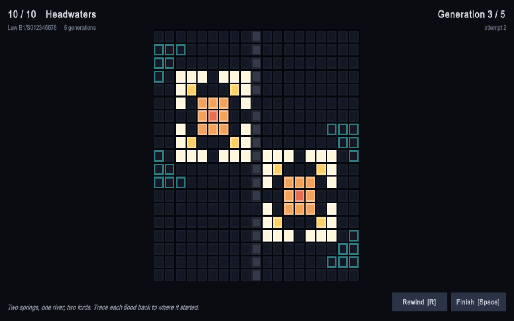

# Point of Origin

*You are shown how it ended. Find where it began.*

A reverse cellular-automaton puzzle made for the Cal Poly Game Development
Club's **World's First Game Jam** (September 2026, theme **ORIGIN**). Every
level shows the aftermath of a simple growth law run for a few generations.
You get the seeds the designer had, place them, press Grow, and watch. The
ghost outline fills in gold where your growth matches and bleeds red where
it does not. Match it exactly and you have found the origin.



## Three languages, one game

| Part | Language | Where | Why |
| --- | --- | --- | --- |
| Simulation core | [Odin](https://odin-lang.org) | `native/sim`, `native/plugin`, `native/cli` | A bounded Life-like automaton with rock cells and per-cell age, built once as `origin_sim.dll` for Unity and once as `origin_cli.exe` for the tools. One implementation, so a level's target is exactly what the game grows. |
| Tooling | [Nexium](https://github.com/Londopy/nexium) | `build.nx`, `tools/bindgen.nx`, `tools/levels.nx` | `bindgen` reads the `@(export)` procs in the Odin plugin and writes the C# `DllImport` surface. `levels` compiles the `.origin` level files into `levels.json`, growing each target through the Odin CLI. `build.nx` runs the whole pipeline. |
| Game | C# / Unity 6 (6000.6) | `unity/PointOfOrigin` | Rendering, input, HUD and synthesised audio. The scene holds only the template camera and light; everything else is built in code at load. |

```
levels/*.origin ──► tools/levels.nx ──(origin_cli.exe)──► Assets/StreamingAssets/levels.json
native/plugin/plugin.odin ──► tools/bindgen.nx ──► Assets/Scripts/Native/PoNative.cs
native/plugin ──► odin build -build-mode:dll ──► Assets/Plugins/x86_64/origin_sim.dll
```

## Build

Requirements: Odin (nightly), Nexium 1.0+, Unity 6000.6 with the Windows
module, the `unity` CLI (optional, for driving the Editor).

```bash
nx run build.nx                 # DLL + CLI, bindings, levels
nx run build.nx -- --skip-odin  # just bindings and levels
```

Then open `unity/PointOfOrigin` and press Play, or build a Windows player:

```bash
unity build unity/PointOfOrigin --editor-version 6000.6.0f1 --target StandaloneWindows64 \
  --execute-method PointOfOrigin.EditorTools.Builder.PerformBuild
```

The Editor keeps a native plugin loaded until it exits, so if the DLL copy
fails, close Unity and run the build again.

## Controls

| Input | Action |
| --- | --- |
| Left click | Plant or remove a seed (planting past the limit replaces the oldest) |
| Right click | Remove a seed |
| Space / Enter | Grow; while growing, finish instantly; after a win, next level |
| R | Rewind to your seeds |
| N | Skip the level |
| V | Reveal the designer's origins (after two failed attempts) |
| M | Sound on or off |
| Esc | Back to the menu; quit from the menu (player build) |

Progress is saved between runs; the menu has a level select and replays the
last solved level's origins growing.

## Levels

Levels are plain text in `levels/`. `#` is rock, `o` an origin, and the tool
grows the target for you:

```
name Ember
rule B1/S
steps 3
hint Rock does not grow and does not count.
map
...............
........#......
.....o..#......
........#......
...............
end
```

Rules are Life-like rulestrings (`B3/S23`). The fifteen jam levels use four
laws: `B1/S012345678` (ripples that keep everything), `B1/S` (sparks that live
one generation), `B1357/S1357` (a parity law whose echoes cancel like waves)
and `B1/S12345678` (coral). An optional `tip` line is shown after the first
failed attempt.

The level compiler also asks the CLI to count how many seed placements grow
the same target (`origin_cli --solve`, a search over the open cells inside the
target's bounding box), so ambiguous levels show up at build time. Fourteen of
the fifteen levels have exactly one solution; the three-seed finale has too
many placements to count.
