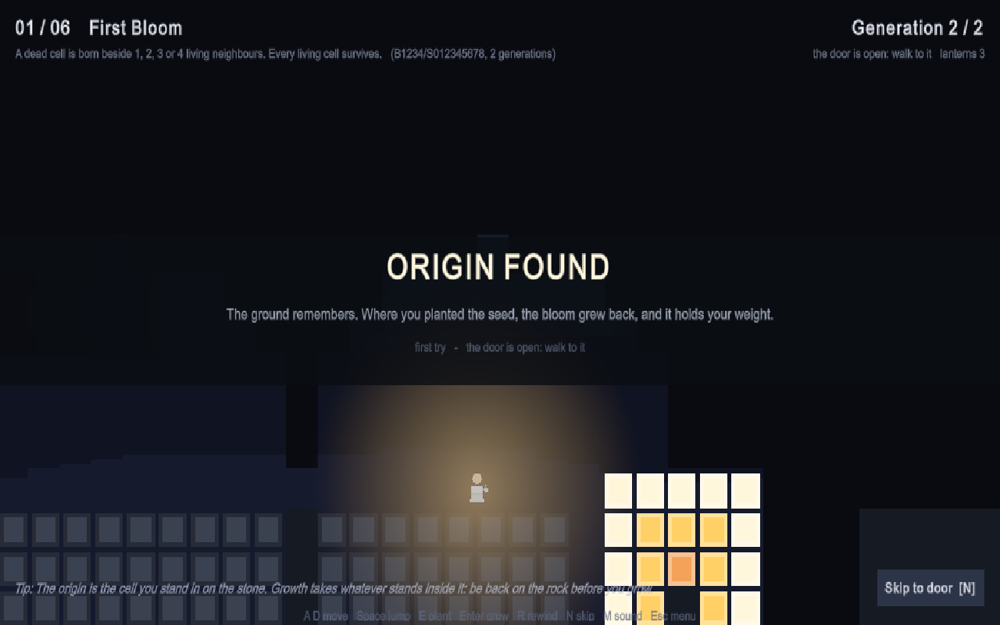

# Point of Origin

[](https://github.com/Londopy/point-of-origin/actions/workflows/ci.yml)
[](https://github.com/Londopy/point-of-origin/releases)
[](https://github.com/Londopy/point-of-origin/releases)
[](https://github.com/Londopy/point-of-origin/commits/main)
[](levels)
[](LICENSE)

[](native/sim)
[](https://github.com/Londopy/nexium)
[](unity/PointOfOrigin)
[](unity/PointOfOrigin/Assets/Scripts)
[](houdini)
[](blender)
[](#build)

[](https://itch.io/jam/cpgd-wfgj)

*You are shown how it ended. Find where it began.*

A side-scrolling platformer built on a reverse cellular-automaton puzzle,
made for the Cal Poly Game Development Club's **World's First Game Jam**
(September 2026, theme **ORIGIN**). You wake in the dark among the ruins of
something that grew. Your lantern shows the ghost of it only around you, so
you run and jump through the ruins to learn the full shape of what a simple
growth law left behind. Find the point it grew from, stand there, plant a
seed, get clear, and press Grow: the living cells rise as solid ground, gold
where they match the outline, red where they do not, and when the growth is
exact the door opens and the growth is the bridge that carries you to it.

It can go wrong. Living growth overgrows whoever stands inside it, so move
away from your seed before you grow, or run. The void below the world takes
anyone who falls. Embers drift along rows and columns in the later chapters
and burn what they touch, though growth puts them out: an ember caught inside
a bloom is quenched until the next rewind. You carry three lanterns per
chapter; lose them all and the dark takes you, then you try again. Ten
chapters across four laws.



## Three languages, one game

| Part | Language | Where | Why |
| --- | --- | --- | --- |
| Simulation core | [Odin](https://odin-lang.org) | `native/sim`, `native/plugin`, `native/cli` | A bounded Life-like automaton with rock cells and per-cell age, built once as `origin_sim.dll` for Unity and once as `origin_cli.exe` for the tools. One implementation, so a level's target is exactly what the game grows. |
| Tooling | [Nexium](https://github.com/Londopy/nexium) | `build.nx`, `tools/bindgen.nx`, `tools/levels.nx` | `bindgen` reads the `@(export)` procs in the Odin plugin and writes the C# `DllImport` surface. `levels` compiles the `.origin` level files into `levels.json`, growing each target through the Odin CLI. `build.nx` runs the whole pipeline. |
| Game | C# / Unity 6 (6000.6) | `unity/PointOfOrigin` | The side-scrolling world (painted into one point-filtered texture), the tile platformer physics, the wanderer, embers, input, HUD and synthesised audio. The scene holds only the template camera and light; everything else is built in code at load. |
| Backdrop | C# + the Odin sim | `GameController.MakeFossils` | Three or four fossils per chapter: growths of the game's own laws (blooms, corals, shell rings) from one or two points, grown by the same simulation at load and pressed into the rock at half scale as pale, chipped imprints with a sediment rim and a relief shadow. They show only where the lantern has revealed the stone. Plus a few warm spores drifting up through the explored air. The ruins of older origins. |
| Effects | Houdini 22 | `houdini/diorama_base.hipnc` | Three things the game replays from text files, because Apprentice cannot write FBX, textures or unwatermarked renders: the parallax ruin skylines (`/obj/backdrop`, a VEX profile of layered noise and pillars, `Resources/Backdrop/skyline.txt`), the growth burst (`/obj/burst`, a Solver SOP particle sim baked frame by frame to `Resources/Backdrop/burst.txt`, drawn around every cell as it is born and every ember as it is quenched) and the stone grain (`/obj/backdrop/grain`, two octaves of periodic noise plus speckle on a 64x64 grid, `Resources/Backdrop/grain.txt`, tiled across every rock cell with a lit line along the surface). The stone slab from the earlier isometric version is still in the scene. |
| Character and props | Blender 5.2 | `blender/render_wanderer.py` | The wanderer, a small flat-shaded figure with a lantern, rendered headlessly with Workbench (Standard view transform, so the colours stay as authored) to two transparent frames (`Resources/Sprites/wanderer_0.png`, `_1.png`: idle and step), plus the ember (`ember.png`) and the seed (`seed.png`) from the same script. An `AssetPostprocessor` keeps them point-filtered and uncompressed. |

```
levels/*.origin ──► tools/levels.nx ──(origin_cli.exe)──► Assets/StreamingAssets/levels.json
native/plugin/plugin.odin ──► tools/bindgen.nx ──► Assets/Scripts/Native/PoNative.cs
native/plugin ──► odin build -build-mode:dll ──► Assets/Plugins/x86_64/origin_sim.dll
```

## Build

Requirements: Odin (nightly), Nexium 1.0+, Unity 6000.6 with the Windows
module, the `unity` CLI (optional, for driving the Editor).

```bash
nx run build.nx                 # DLL + CLI, bindings, levels
nx run build.nx -- --skip-odin  # just bindings and levels
```

Then open `unity/PointOfOrigin` and press Play, or build a Windows player:

```bash
unity build unity/PointOfOrigin --editor-version 6000.6.0f1 --target StandaloneWindows64 \
  --execute-method PointOfOrigin.EditorTools.Builder.PerformBuild
```

The Editor keeps a native plugin loaded until it exits, so if the DLL copy
fails, close Unity and run the build again.

## Controls

The defaults; every key in the table except Esc can be changed on the
Controls page, and the arrows, W and Enter always work as well.

| Input | Action |
| --- | --- |
| A / D or arrows | Run |
| Space, W or Up | Jump (hold for height, let go early for a hop) |
| E | Plant or take back a seed in the cell you stand in (planting past the limit replaces the oldest) |
| Enter / G | Grow; while growing, finish instantly |
| R | Rewind the growth (planted seeds stay) |
| N | Skip the level |
| V | Reveal the designer's origins (after two failed attempts) |
| M | Sound on or off |
| Esc | Pause menu in a chapter (resume, restart, chapter select, settings, controls, credits, quit); quit from the title |

## Tutorial, menu, settings, controls

The first chapter is the tutorial: a prompt under the header tells you the
one thing to do next (run, jump, reach the marked stone, plant, get clear,
grow, cross) and moves on when you have done it, and the stone is marked
through the dark. It runs until First Bloom has been solved once. How to Play
in the menus keeps the loop in six lines.

The title screen has the chapter select, How to play, Settings, Controls,
Credits and Quit, and replays the last solved chapter's origins growing behind
it. Esc in a chapter pauses the world and opens the same pages. Settings holds master and
music volume (ten steps each), sound on or off, screen shake, fullscreen and a
two-click progress reset. Controls lists every action with its key: click a
key, press a new one, and if that key was already in use the two actions swap
so nothing is left unbound. Bindings, volumes and progress are saved in
`PlayerPrefs` (`po.*`).

`tools/platform_check.py` checks every chapter for reachability (stone, seeds,
a safe place to stand, the door once grown) with a coarse jump model; run it
after editing a level.

## Levels

Levels are plain text in `levels/`, side view, row 0 at the top. `#` is rock,
`o` an origin, `s` where the wanderer wakes, `x` the door, `k` a seed lying in
the world (when a level has any, the wanderer starts empty-handed and must
fetch them), `e` an ember that patrols its row and `E` one that patrols its
column, and the tool grows the target for you. `intro` and `outro` lines carry
the story:

```
name First Bloom
rule B1234/S012345678
steps 2
hint Something bloomed from the stone down in the chasm.
map
...s.....................................x..
##################.........#################
##################.........#################
##################...o.....#################
##################...#.....#################
end
```

Rules are Life-like rulestrings (`B3/S23`). The ten chapters use four laws
whose growth is walkable: `B1234/S012345678` (a bloom: a solid square),
`B1/S` for one generation (a spark leaves a hollow ring), `B1357/S1357` (a
parity echo, a cross inside a broken ring; two echoes three cells apart
overlap into one bar) and `B1/S12345678` (coral, a mound). Rock clips the
growth, so a bloom in a pit is a slab and an echo on a floor is only its top
half; the compiler grows the real target, so what you see is what you must
match. An optional `tip` line is shown after the first failed attempt.
Every chapter is a road, not just a puzzle: a platforming approach (dips
with a floor, embers fenced between posts you jump over, seeds to fetch on
ledges) leads to the stones, and a run with more of the same leads from the
growth to the door. Maps are 56 to 110 cells wide.

Chapters 1 to 4 put each stone in a chasm, where it is the only place to
stand: the puzzle there is the loop itself. From chapter 5 on, finding the
origin is the puzzle. Each stone lies somewhere on the floor of a wide trench
at the foot of a cliff, the cliff clips the growth, so the visible shape is
off-centre and you count generations back from its open edge; the growth's
top is the only way up the cliff. Two Echoes plants two origins two cells
apart under the parity law, where the echoes cancel each other and leave a
hole exactly where you would look first. Quench fills an ember's trench,
Ashfall climbs past two pits, and Origin grows a mesa cut by a wall. The
level compiler counts placements that reproduce each target, so every
chapter has exactly one answer.

The level compiler also asks the CLI to count how many seed placements grow
the same target (`origin_cli --solve`, a search over the open cells inside the
target's bounding box), so ambiguous levels show up at build time. Every
chapter has exactly one solution.

## Checks

CI runs on every push: `odin test native/sim` (the automaton's laws, rock,
ages and the Jaccard compare), a build of the CLI and the plugin,
`tools/verify_levels.py` (re-grows every chapter with the CLI and compares it
to the committed `levels.json`), `tools/platform_check.py`, a one-solution
check, and a check that every Odin export has its C# import. A tag `v*`
drafts a GitHub release; the Windows zip is attached from the machine that
built it. `unity-build.yml` can build the player on GitHub's runners but is
manual, since it needs a Unity licence in the secrets.

## Driving the Editor from a terminal

The project has Unity's Pipeline package, so with the Editor open the `unity`
CLI can drive it: `unity status` shows it as ready, `unity command` lists what
it exposes, and `unity command eval_file` runs a C# snippet inside it. The
scripted playtests in this project's history (physics probes, a bot that
plays chapter 1, solving every chapter from its origins) were run that way.
